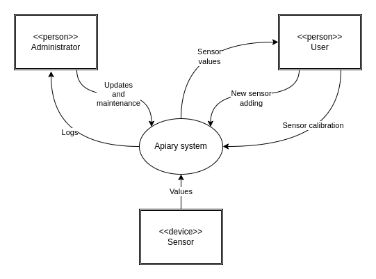
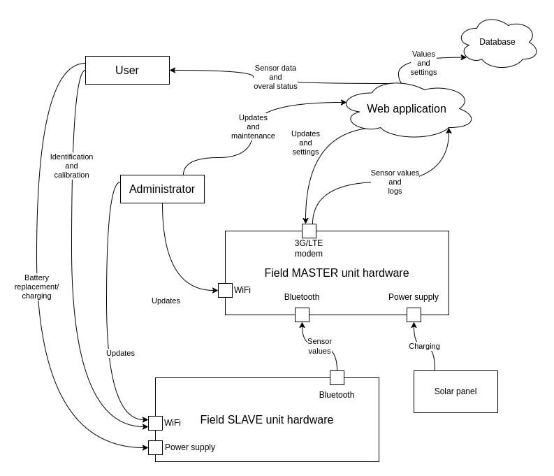
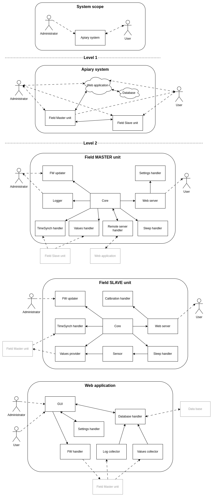

# 1 Introduction and goals

This document describes the Apiary system, which main goal is to help to beekepers with having adequate information about current condition of the bee families and planning necessary actions based on these informations. As the result this should prevent swarming, decrease infection by Varoa and viruses and increase honey production.

## 1.1 Requirements overview

The Apiary system should be able to safely collect, store and provide the data from the installed sensors (weight scales, temperature sensors, ...). The stored data should be accessible via any web browser in a user-friendly format.
The system should contain the following parts:
- the sensors and data collectors installed in the field
- a database installed on a remote server with API to store/retrieve data
- a web application for access the data from the user side

The Apiary system should be able to:
- collect values from the installed sensors
- store the collected values
- provide a web interface for the user to work with stored data
- operate with aproppriate power supply (bateries in the field)
- provide an interface for calibration of sensors (if necessary)
- detect and log errors, store the logs on a remote server

## 1.2 Quality goals

### 1.2.1 Quality tree

| Quality category | Quality             | Description                                                                     | Scenario |
| ---------------- | ------------------- | ------------------------------------------------------------------------------- | -------- |
| Usablity         | Easy to use         | Easy to use by beekeeper also in the field                                      |          |
|                  | Easy to learn       | The standard functions should be intuitive                                      |          |
| Stability        | Stable in the field | The field parts should provide their functions with no breakdown                | SC1      |
|                  | Web stability       | The web application should provide all the required functions with no breakdown |          |
| Performance      | Accuracy            | The collected values should be correct                                          | SC2      |
|                  | Robustness          | The system should work reliable under all specified conditions                  |          |

### 1.2.2 Quality scenarios

| Id  | Scenario                                                                                                                                      |
| --- | --------------------------------------------------------------------------------------------------------------------------------------------- |
| SC1 | Every sensor powered by battery should be able to work during the time specified in the 'Solution strategy' without battery change / charging |
| SC2 | The values should be accurate enough - more specified in 'Solution strategy'                                                                  |

## 1.3 Stakeholders

ME :-)

# 2 Constrains

There are the following constraints:
- There can be no Internet connection in the field
- There can be no access to the remote server in the field

# 3 Context and scope

## 3.1 Business context

The following figure shows the inputs and outputs of the Apiary system - the human users and the technical environment.

## 3.2 Technical context

The technical concepts shows the channels between the units of Apiary system and the users who operate it.

# 4 Solution strategy

## 4.1 Basic quality solutions

1. Easy to use: Installation of new sensor must be easy and intuitive. Calibration can be done via a web server integrated into the Slave field unit. The Master field unit shall also provide a web interface for configuration of 3G/LTE connection. The web application shall be very intuitive and easily provide requested data and apply requested change of settings.
2. Easy to learn: The use documentation shall be intuitive and easy to understand by the end user. No unnecessary functions shall be provided.
3. Stability in the field: The both Master and Slave field units shall have stable runtime based on the stable, commonly used and well tested HW. There shall be no breakdowns during expluatation.
4. Web stability: The web application shall provide all the required data and functions in the common web browsers - both mobile and desktop versions.
5. Accuracy: The values collected from sensors shall be correct up to 1% of the real value.
6. Robustness: The system should work correctly under the specified conditions (temperature, humidity, EMC, etc.)

## 4.2 Extended quality solutions

### 4.2.1 Field units

1. One installation field (apiary) shall require only 1 Master field unit.
2. Up to 16 Slave field units shall be connected to one Master unit.
3. The Slave unit shall run  at least 4 months without battery change / charging.
4. The Master unit shall be powered by solar panel, so no battery change or manual charging shall be required.
5. Installation (uncluding calibration) of a new Slave unit shall be possible to do within 5 minutes time interval.
6. The collected values and logs shall be cached in the Master unit in a rotation buffer with 1 month time interval, but just in case of inaccessible remote server (no Internet connection or server breakdown).
7. The frequency of data collection shall be constant, but shall be easily changed to be a variable in the next version. The initial frequency is 6 shots per minute.

### 4.2.2 Web application

1. Any request for data or settings change shall processed in 100ms time interval.
2. Any change of the field units settings shall be applied in 1h time interval.

# 5 Building block view

